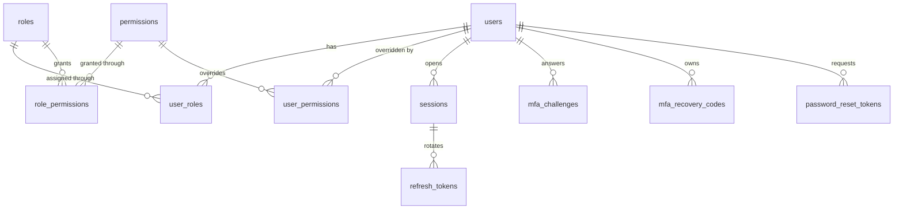

# Database ERD

Both schemas have this structure. There are no relationships between them.

```mermaid
erDiagram
    users ||--o{ user_roles : has
    roles ||--o{ user_roles : "assigned through"
    roles ||--o{ role_permissions : grants
    permissions ||--o{ role_permissions : "granted through"
    users ||--o{ user_permissions : "overridden by"
    permissions ||--o{ user_permissions : overrides
    users ||--o{ sessions : opens
    sessions ||--o{ refresh_tokens : rotates
    users ||--o{ mfa_challenges : answers
    users ||--o{ mfa_recovery_codes : owns
    users ||--o{ password_reset_tokens : requests
```

`audit_logs` and `rate_limit_counters` stand alone, with no foreign keys.
